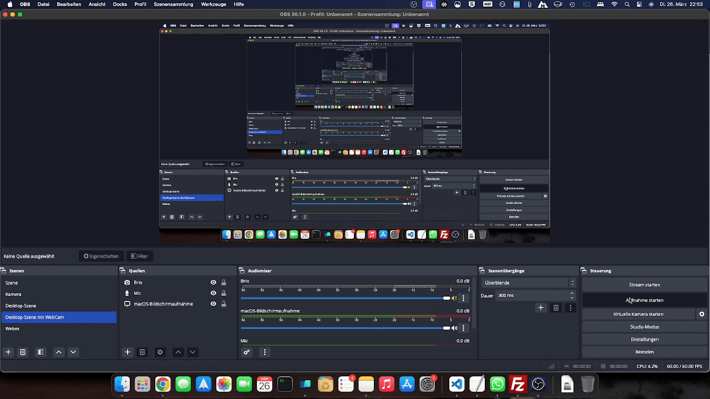

# Database-Chat-Bot

## Beschreibung des Projekts

Das Projekt "Database-Chat-Bot" ist eine Anwendung, die es ermöglicht, SQL-Abfragen in natürlicher Sprache zu stellen und die Ergebnisse in einer benutzerfreundlichen Weise anzuzeigen. Es nutzt die KI-Technologie von Anthropics _(`Claude`)_, um die natürliche Sprache in SQL-Abfragen zu übersetzen. Die Anwendung ist in Python geschrieben und verwendet Flask für das Web-Framework und `pymssql` für die Datenbankverbindung.

> _Hinweis:_ Dies funktioniert derzeit nur mit MS SQL Server. Sie können die Datenbankverbindung in der Datei "app.py" leicht ändern und ein anderes Modul als `pymssql` verwenden.

> _Vergessen Sie nicht:_ Dies wurde mit Claude implementiert, könnte aber leicht durch **OpenAI GPT-3** ersetzt werden.

## Beispiel



## Bevor Sie beginnen

Bennenen Sie die Datei `EXAMPLE.env` in `.env` um und füllen Sie die erforderlichen Umgebungsvariablen aus.

Editieren Sie die `.env`-Datei und fügen Sie die folgenden Umgebungsvariablen hinzu:

```env
ANTHROPIC_API_KEY = "YOUR_ANTHROPIC_API_KEY"
FLASK_APP=app.py
FLASK_ENV=development
DB_HOST=YOUR_DB_HOST
DB_PORT=1433
DB_NAME=YOUR_DB_NAME
DB_USER=YOUR_DB_USER
DB_PASSWORD=YOUR_DB_PASSWORD
```

## Verwendung des Projekts via Docker-Compose

Um das Projekt mit Docker-Compose zu verwenden, führen Sie die folgenden Schritte aus:

1. Stellen Sie sicher, dass Docker und Docker-Compose auf Ihrem System installiert sind.
2. Klonen Sie das Repository und navigieren Sie in das Projektverzeichnis.
3. Führen Sie den Befehl `docker-compose up` aus. Dies wird die Anwendung und alle zugehörigen Dienste starten.
4. Die Anwendung ist nun unter `http://localhost:5070` erreichbar.

## Verwendung des Projekts ohne Docker-Compose nur mit Python

Um das Projekt ohne Docker-Compose nur mit Python zu verwenden, führen Sie die folgenden Schritte aus:

1. Stellen Sie sicher, dass Python 3.10 auf Ihrem System installiert ist.
2. Klonen Sie das Repository und navigieren Sie in das Projektverzeichnis.
3. Installieren Sie die erforderlichen Python-Pakete mit dem Befehl `pip install -r requirements.txt`.
4. Starten Sie die Anwendung mit dem Befehl `python app.py`.
5. Die Anwendung ist nun unter `http://localhost:5000` erreichbar.

## Lizenz

Dieses Projekt steht unter der MIT-Lizenz. Weitere Informationen finden Sie in der [Lizenzdatei](https://opensource.org/licenses/MIT).

## Autor

Dieses Projekt wurde von Michael Muyakwa erstellt.

## Hinweise zur Weiterentwicklung des Projekts

Dieses Projekt wurde erstellt, um die Möglichkeiten der KI-Technologie von Anthropics zu erkunden. In Zukunft könnte eine Version mit OpenAI GPT-3 implementiert werden. Wenn Sie an der Weiterentwicklung dieses Projekts interessiert sind, sind Beiträge willkommen.

> _Siehe auch:_ [Docker-Compose](https://www.google.com/search?q=docker-compose), [Python](https://www.google.com/search?q=python), [Flask](https://www.google.com/search?q=flask), [pymssql](https://www.google.com/search?q=pymssql), [Anthropics](https://www.google.com/search?q=anthropics)
> _Sie könnten auch interessiert sein an:_ [SQL](https://www.google.com/search?q=sql), [KI-Technologie](https://www.google.com/search?q=ki-technologie), [OpenAI GPT-3](https://www.google.com/search?q=openai+gpt-3)
